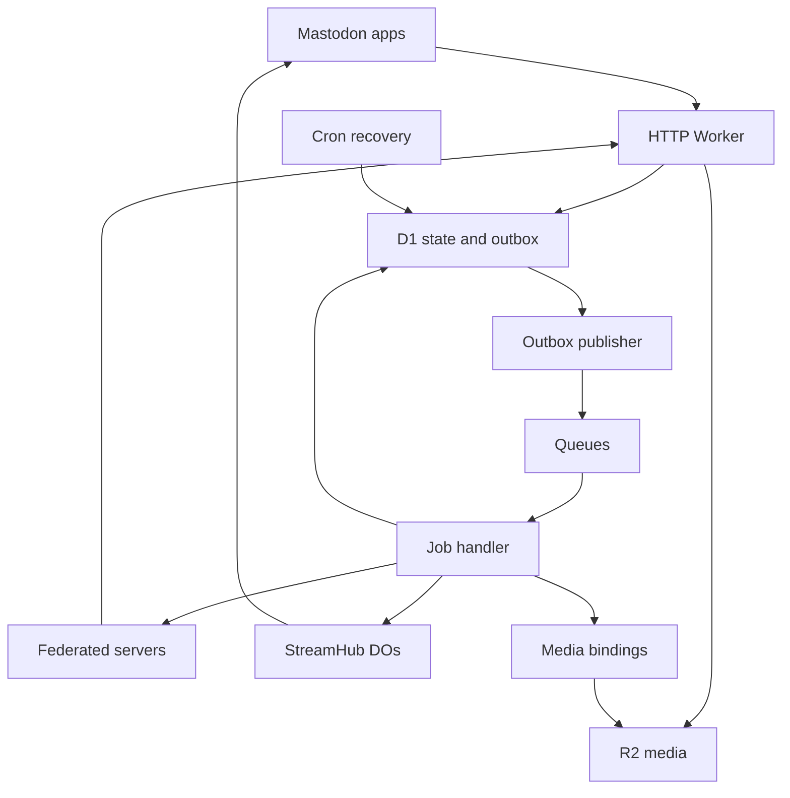

# Hyena: Wildebeest assessment and complete implementation plan

**Research cut-off:** 10 September 2026, UTC
**Constraints:** No containers. Minimize recurring cost. Support Mastodon posting, federation, and unmodified Mastodon apps.
**Status:** Implementation started in [mitchell-johnson/Hyena](https://github.com/mitchell-johnson/Hyena), branch `feat/workers-foundation`. See [the implementation record](implementation.md) for delivered behavior and remaining gates. No live deployment or real-client certification has been performed.

**Updated constraint:** All audio and video must be strictly shorter than 60 seconds. The first implementation validates duration and uses R2, Images, and Media Transformations. Managed Stream is excluded from the baseline; the fallback discussion below is historical contingency planning for codec gaps, not an enabled service.

**Navigate:** [Source assessment](#2-repository-assessment-and-fork-status) · [Cloudflare changes](#3-cloudflare-developments-that-change-the-design) · [Queues decision](#6-queues-versus-durable-objects-explicit-decision) · [API scope](#9-mastodon-api-compatibility-ledger) · [Media](#11-container-free-media-pipeline) · [Costs](#15-cost-model-and-cost-controls) · [Build phases](#16-build-phases-dependencies-and-effort) · [Release tests](#17-verification-and-release-gates)

## 1. Decision and scope

Build a new TypeScript application in a fork of Wildebeest, retaining its history and attribution. Use one Workers application, D1 for relational state, R2 for media, Queues for asynchronous delivery, and SQLite-backed Durable Objects for live streams. Use the current Images binding and evaluate the new Media Transformations binding for container-free media processing. Keep the first deployment small enough for a personal instance, while implementing the actual Mastodon contracts.

**Keep Queues initially.** Durable Objects have persistent identity and storage, but their JavaScript processes do not run forever. A reliable job service built with their storage and alarms is possible; it would be a queue implementation we must maintain. At personal-instance volumes, the included Queues allowance usually eliminates any direct saving from removing Queues. Section 6 specifies both designs and the circumstances that would justify changing this decision.

**Expected hosting floor: approximately US$5/month under the example workload in section 15**, plus a domain and any usage above allowances. This is a calculated budget scenario, not a measured bill or a guarantee. Cheap hosting is realistic; reproducing years of Mastodon behavior is the expensive part of this project. Current Workers Paid pricing starts at $5/month. [Workers pricing](https://developers.cloudflare.com/workers/platform/pricing/)

The short-media constraint resolves the long-output-duration mismatch, but media format and codec parity still require live tests. Cloudflare now offers useful managed video transformations without containers, but the documented input formats and output duration limits do not establish a complete replacement for Mastodon's media pipeline. Test actual app uploads before committing to the rest of the build. A text-only implementation must not be described as fully compatible.

### 1.1 What “fully Mastodon compatible” means here

Pin the first release target to **Mastodon 4.7.1**, the latest stable release verified for this assessment, and record its exact source revision. Compatibility means observable behavior against that version: routes, methods, request encodings, OAuth, scopes, JSON fields and nullability, pagination, posting semantics, streaming, Web Push, and federation. It also means current selected apps can connect and complete their ordinary workflows without patches. It does not mean identical implementation internals or perpetual compatibility with all future releases. [Mastodon 4.7.1 release](https://github.com/mastodon/mastodon/releases/tag/v4.7.1)

The public client API matrix in section 9 is a release requirement. Optional capabilities may be disabled only where the reference server supports that configuration and reports it correctly. An endpoint returning an empty list is valid when the user's list is empty; it is not a substitute for implementing the feature. Advanced administration and operational functions are included in the build plan. The built-in web interface need not visually reproduce Mastodon's interface.

### 1.2 Assumptions that can be changed without redesign

| Item | Initial assumption | Consequence |
| --- | --- | --- |
| Users | One owner, with provision for a small invited community | Closed registration and one D1 database initially |
| Domain | One stable instance domain, selected before public federation | Actor and object URLs must remain stable thereafter |
| Budget | Optimize around the $5 Workers Paid baseline | No mandatory always-on compute, Redis, external database, or video hosting subscription |
| Media | All audio/video strictly below 60 seconds; processed media in R2 | Remove staged originals after processing; retain final authored media; expire abandoned uploads |
| Scale | Modest personal-instance traffic; benchmark before setting a supported limit | Avoid premature database sharding and per-user job infrastructure |
| Identity | Ordinary Mastodon OAuth with owner/admin login | Cloudflare Access may protect a separate operator interface, not replace app authentication |
| Operations | One production environment; temporary staging for release checks | No permanent duplicate paid infrastructure unless testing requires it |

These are planning defaults, not claims about an existing production account or instance.

## 2. Repository assessment and fork status

### 2.1 Inspected baselines

| Repository | Revision inspected | Role |
| --- | --- | --- |
| `cloudflare/wildebeest` | `b056670a7204bc4d852c8a0cda9a3c9e39f8a0e1`, 8 October 2024 | Full local checkout and source audit; current upstream HEAD at inspection |
| `mastodon/mastodon`, tag `v4.7.1` | `bc19d30b90403d9d058da301bcd7fafcc03fbf92` | Local reference checkout of routes, controllers, serializers, and changelog |
| `fedify-dev/fedify`, release `2.3.6` | Released 23 August 2026 | Candidate protocol library; its Workers integration still requires a project-specific spike |

Sources: [Wildebeest baseline](https://github.com/cloudflare/wildebeest/tree/b056670a7204bc4d852c8a0cda9a3c9e39f8a0e1), [Mastodon baseline](https://github.com/mastodon/mastodon/tree/bc19d30b90403d9d058da301bcd7fafcc03fbf92), [Fedify release](https://github.com/fedify-dev/fedify/releases/tag/2.3.6).

**Remote fork status:** The user supplied [mitchell-johnson/Hyena](https://github.com/mitchell-johnson/Hyena). Its initial `main` is the audited Wildebeest SHA. The implementation uses `feat/workers-foundation`, retains the old source as reference, and adds a fresh runtime and a separate D1 schema. It does not publish to Cloudflare's upstream repository.

### 2.2 Findings from actual code

The README describes Wildebeest as unmaintained. The application's claimed Mastodon API version is 4.0.2. Its historical supported-client list is useful evidence of earlier experiments, not a test result for today's apps. [README](https://github.com/cloudflare/wildebeest/blob/b056670a7204bc4d852c8a0cda9a3c9e39f8a0e1/README.md), [version declaration](https://github.com/cloudflare/wildebeest/blob/b056670a7204bc4d852c8a0cda9a3c9e39f8a0e1/config/versions.ts), [historical client list](https://github.com/cloudflare/wildebeest/blob/b056670a7204bc4d852c8a0cda9a3c9e39f8a0e1/docs/supported-clients.md).

The checkout contains 58 TypeScript files under `functions`, including middleware, 39 of them under the API tree; 11 SQL migrations; and 30 `*.spec.ts` files across the project. These inventory counts describe coverage surface, not verified behavior. Tests were inspected, not executed as a modern compatibility suite.

| Area | Evidence in the pinned checkout | Assessment and replacement action |
| --- | --- | --- |
| Runtime and deployment | Wrangler 2.7.1, TypeScript 4.9.4, old Miniflare/Jest setup, Node 16 CI; separate frontend, consumer, and DO packages | Rebuild toolchain and deployment around current Workers tooling; preserve useful fixtures. [Package manifest](https://github.com/cloudflare/wildebeest/blob/b056670a7204bc4d852c8a0cda9a3c9e39f8a0e1/package.json), [CI](https://github.com/cloudflare/wildebeest/blob/b056670a7204bc4d852c8a0cda9a3c9e39f8a0e1/.github/workflows/PRs.yml) |
| Posting visibility | Create-status route accepts `public` and `direct`; other visibility modes are rejected | Implement all four visibility modes and recipient-aware reads and delivery before production. [Status creation](https://github.com/cloudflare/wildebeest/blob/b056670a7204bc4d852c8a0cda9a3c9e39f8a0e1/functions/api/v1/statuses.ts) |
| Mutation lifecycle | Status creation performs delivery work in the request path and records idempotency late | Replace with transactional local mutation plus durable delivery intent; make retries return the original result. Same source as above. |
| Editing | Status resource exposes reading/deletion without the complete current edit/history/source behavior | Build revisions, editing restrictions, history, and federated updates as first-class operations. [Status resource](https://github.com/cloudflare/wildebeest/blob/b056670a7204bc4d852c8a0cda9a3c9e39f8a0e1/functions/api/v1/statuses/%5Bid%5D.ts) |
| OAuth | Authorization derives a code from a Cloudflare Access JWT; token exchange returns that code as the bearer token | Replace with independently expiring, single-use authorization codes and scoped app tokens; implement current discovery and PKCE. [Authorize](https://github.com/cloudflare/wildebeest/blob/b056670a7204bc4d852c8a0cda9a3c9e39f8a0e1/functions/oauth/authorize.ts), [token](https://github.com/cloudflare/wildebeest/blob/b056670a7204bc4d852c8a0cda9a3c9e39f8a0e1/functions/oauth/token.ts) |
| Feature completeness | Blocks, mutes, and filters have unconditional empty responses | Replace stubs with persistent state and enforcement across REST, search, notifications, and streams. [Blocks](https://github.com/cloudflare/wildebeest/blob/b056670a7204bc4d852c8a0cda9a3c9e39f8a0e1/functions/api/v1/blocks.ts), [mutes](https://github.com/cloudflare/wildebeest/blob/b056670a7204bc4d852c8a0cda9a3c9e39f8a0e1/functions/api/v1/mutes.ts), [filters](https://github.com/cloudflare/wildebeest/blob/b056670a7204bc4d852c8a0cda9a3c9e39f8a0e1/functions/api/v1/filters.ts) |
| Delivery fan-out | Enumerates followers and settles promises without using every failure outcome; no shared-inbox consolidation in that path | Use bounded recipient expansion, destination deduplication, and a delivery ledger. [Delivery code](https://github.com/cloudflare/wildebeest/blob/b056670a7204bc4d852c8a0cda9a3c9e39f8a0e1/backend/src/activitypub/deliver.ts) |
| Queue processing | Outer catch logs and returns; a missing actor can return from the batch | Under current Queues semantics, successful return acknowledges unhandled messages. Use explicit per-message outcomes and durable retry state. [Consumer](https://github.com/cloudflare/wildebeest/blob/b056670a7204bc4d852c8a0cda9a3c9e39f8a0e1/consumer/src/index.ts), [Queues acknowledgements](https://developers.cloudflare.com/queues/configuration/batching-retries/) |
| Timeline computation | Inbox consumer rebuilds cached timeline and notification material | Use indexed incremental updates, bounded pagination, and measured fan-out. [Inbox consumer](https://github.com/cloudflare/wildebeest/blob/b056670a7204bc4d852c8a0cda9a3c9e39f8a0e1/consumer/src/inbox.ts) |
| Durable Objects | Existing DO is a cache, addressed through a global `cachev1` name | It is not already a durable job scheduler or streaming implementation. Replace its role; avoid retaining a global bottleneck. [DO](https://github.com/cloudflare/wildebeest/blob/b056670a7204bc4d852c8a0cda9a3c9e39f8a0e1/do/src/index.ts), [cache adapter](https://github.com/cloudflare/wildebeest/blob/b056670a7204bc4d852c8a0cda9a3c9e39f8a0e1/backend/src/cache/index.ts) |
| Media | Uses hosted Cloudflare Images; attachment metadata contains fixed placeholder values | Store media in R2 and derive actual dimensions, duration, previews, and blurhash. [Media implementation](https://github.com/cloudflare/wildebeest/blob/b056670a7204bc4d852c8a0cda9a3c9e39f8a0e1/backend/src/media/index.ts) |
| Data model | Actor/object JSON with relational adjuncts and an existing FTS5 table | FTS is not a new capability missing from Wildebeest. Normalize hot paths and make ownership/visibility queryable. [Initial schema](https://github.com/cloudflare/wildebeest/blob/b056670a7204bc4d852c8a0cda9a3c9e39f8a0e1/migrations/0000_initial.sql) |
| Streaming | No streaming route found in the inspected functions tree | Implement Mastodon WebSocket and HTTP streaming protocols; do not equate cached timelines with streaming. [Functions tree](https://github.com/cloudflare/wildebeest/tree/b056670a7204bc4d852c8a0cda9a3c9e39f8a0e1/functions) |

### 2.3 Reuse policy

Retain repository history, Apache-2.0 notices, useful ActivityPub fixtures, and examples that pass new behavioral tests. Replace the OAuth design, delivery lifecycle, cache architecture, media metadata, API stubs, deployment scripts, and obsolete runtime assumptions. Keep the new code in the same fork, but do not make preserving old abstractions a requirement. Reference Mastodon behavior through tests; audit the license of any code actually copied from it or dependencies. [Wildebeest license](https://github.com/cloudflare/wildebeest/blob/b056670a7204bc4d852c8a0cda9a3c9e39f8a0e1/LICENSE)

## 3. Cloudflare developments that change the design

This survey covers the current developer-platform capabilities relevant to this build, including the latest September 2026 changelog entries. It is not a claim that every Cloudflare enterprise or unrelated product belongs in the application. Dates below distinguish a dated release from a capability simply verified as current. Beta features are marked explicitly. [Cloudflare changelog](https://developers.cloudflare.com/changelog/)

| Capability and freshness | Impact on this build | Decision and source |
| --- | --- | --- |
| Workers bundle limit increased, 4 Sep 2026 | 64 MiB uncompressed limit gives more room for protocol libraries; CPU and memory limits still matter | Adopt current tooling; do not use bundle size to justify heavyweight media processing. [Release](https://developers.cloudflare.com/changelog/post/2026-09-04-increased-worker-size-limit/) |
| Miniflare 5, 8 Sep 2026 | Current local runtime/configuration differs substantially from Wildebeest's testing stack | Adopt supported current runtime. The new `cf` CLI is described as upcoming, so do not base production scripts on an unreleased CLI. [Release](https://developers.cloudflare.com/changelog/post/2026-09-08-miniflare-v5/) |
| Current Vite and Vitest integration | Tests can exercise Workers bindings and runtime behavior directly | Use Workers Vite integration and the currently documented `@cloudflare/vitest-plugin`; pin a mutually compatible toolchain. [Vite](https://developers.cloudflare.com/workers/vite-plugin/), [Vitest](https://developers.cloudflare.com/workers/testing/vitest-integration/) |
| Workers Static Assets | Same application can serve UI assets and API routes | Replace the historical Pages/separate-consumer arrangement. [Static Assets](https://developers.cloudflare.com/workers/static-assets/) |
| Workers Cache, current September 2026 documentation | Response caching can avoid executing the Worker on a hit and works with placement | Evaluate for explicitly public representations after correctness. Enabling it also makes otherwise-free static/service-binding requests billable, so do not assume every cache hit saves request cost. [Workers Cache](https://developers.cloudflare.com/workers/cache/) |
| Workers Rate Limiting binding | Fast per-key admission checks without a D1 query on every attempt | Adopt for coarse request throttling. Counters are location-local and eventually consistent, so retain authoritative upload quotas and accounting in D1. [Rate Limiting](https://developers.cloudflare.com/workers/runtime-apis/bindings/rate-limit/) |
| D1 maturation since the alpha-era application | Production SQL, backups, improved performance, and larger account capacity make D1 more practical | Adopt a single relational database initially. Do not interpret an account-level storage increase as a larger per-database limit. [D1 release notes](https://developers.cloudflare.com/d1/platform/release-notes/) |
| D1 free-tier quota enforcement, 1 Sep 2026 | Exceeding free allowances can stop queries | Budget for Workers Paid and monitor row counts; do not promise indefinite free hosting. [Release](https://developers.cloudflare.com/changelog/post/2026-09-01-d1-free-tier-limit-enforcement/) |
| D1 read replication and Sessions, current public beta | Can reduce geographically distant read latency while exposing consistency choices | Defer initially. Use the primary for auth/private/read-after-write paths; benchmark public replicas later. [Read replication](https://developers.cloudflare.com/d1/best-practices/read-replication/) |
| SQLite-backed Durable Objects | Transactional local state and recovery are useful for coordinated streams and optional schedulers | Adopt for new StreamHub namespaces. They do not create transactions with D1. [SQLite storage](https://developers.cloudflare.com/durable-objects/api/sqlite-storage-api/) |
| Declarative DO class exports, 30 Jun 2026 | New DO lifecycle configuration replaces old migration-array assumptions | Use current `exports` declarations for new namespaces; preserve any old namespace until explicitly migrated. [DO release notes](https://developers.cloudflare.com/durable-objects/release-notes/), [class exports](https://developers.cloudflare.com/durable-objects/reference/durable-objects-migrations/) |
| WebSocket hibernation | Idle connections can persist without continuously charging DO execution time | Adopt for Mastodon live streams; persist connection attachment data and tolerate restarts. [WebSockets](https://developers.cloudflare.com/durable-objects/best-practices/websockets/) |
| DO lifecycle and alarms | Persistent storage survives process eviction; alarms provide bounded automatic retries | Useful primitives, not proof that an in-memory worker can run jobs forever. [Lifecycle](https://developers.cloudflare.com/durable-objects/concepts/durable-object-lifecycle/), [alarms](https://developers.cloudflare.com/durable-objects/api/alarms/) |
| Queues with per-message retries and DLQs | Managed delivery transport, batching, retries, and consumer scaling | Retain; persist business intent in D1 so queue retention does not define data durability. [Queues limits](https://developers.cloudflare.com/queues/platform/limits/) |
| Workflows | Durable multi-step execution is useful for long imports, exports, and migrations | Defer as a required product. Reconsider for long administrative jobs if it reduces code; no workflow per status. [Workflows](https://developers.cloudflare.com/workflows/) |
| Images binding, including 2 Sep 2026 additions | Direct R2 input, metadata inspection, transformations, and newer management features | Adopt needed inspection/transformation features; signed creator uploads are optional because standard clients upload through Mastodon APIs. [Binding](https://developers.cloudflare.com/images/optimization/binding/), [release](https://developers.cloudflare.com/changelog/post/2026-09-02-images-binding-updates/) |
| Media Transformations Workers binding, current open beta | Processes private R2 streams and can extract video posters without a container | Evaluate in the first feasibility gate. Store outputs once; beta pricing and format limits prevent assuming a free universal transcoder. [Binding](https://developers.cloudflare.com/stream/transform-videos/bindings/) |
| R2 storage, conditional/ranged reads, lifecycle rules | Cheap originals and derivatives, efficient video playback, bounded remote caches | Adopt Standard storage, controlled media delivery, and separate retention classes. [Workers API](https://developers.cloudflare.com/r2/api/workers/workers-api-reference/), [lifecycle rules](https://developers.cloudflare.com/r2/buckets/object-lifecycles/) |
| R2 Data Access Logs GA, 4 Sep 2026 | Useful diagnostic evidence for successful object access | Optional. Best-effort logs that omit failed accesses cannot be the authoritative audit or delivery ledger. [Release](https://developers.cloudflare.com/changelog/post/2026-09-04-r2-data-access-logs/) |
| Native OpenTelemetry export | Logs and traces can be exported without a self-hosted collector | Use sampled logs/traces; metrics require the separate platform metrics path. [OTel export](https://developers.cloudflare.com/workers/observability/exporting-opentelemetry-data/) |
| Smart Placement | API latency may improve when execution is closer to the database | Benchmark after correctness; do not assume globally distributed compute removes database round trips. [Placement](https://developers.cloudflare.com/workers/configuration/placement/) |
| Outbound Email Service, beta | Potentially supplies account verification/reset mail entirely on Cloudflare | Optional provider adapter, subject to account availability and pricing; inbound Email Routing alone is insufficient. [Email Service](https://developers.cloudflare.com/email-service/) |
| Secrets Store | Shared secret management can help larger deployments | Ordinary Worker secrets are enough initially; defer another required service. [Secrets Store](https://developers.cloudflare.com/secrets-store/) |
| Hyperdrive | Provides a path to an external PostgreSQL database if D1 becomes unsuitable | Escape hatch only; adds external infrastructure and is excluded from the initial stack. [Hyperdrive](https://developers.cloudflare.com/hyperdrive/) |
| Workers AI, AI Search, Vectorize | Optional translation or other additional features | Do not put AI inference or vector search on the posting path. Mastodon search needs exact visibility enforcement, not RAG. [Workers AI](https://developers.cloudflare.com/workers-ai/), [AI Search](https://developers.cloudflare.com/ai-search/) |
| R2 SQL and data pipelines | Analytical queries and ingestion serve a different workload | Defer; not a transactional social-graph database replacement. [R2 SQL](https://developers.cloudflare.com/r2-sql/) |
| Realtime | WebRTC infrastructure addresses a different protocol | Not required for Mastodon's WebSocket/SSE streams. [Realtime](https://developers.cloudflare.com/realtime/) |
| Containers, Sandbox, browser execution | Additional execution environments do not satisfy the chosen hosting constraint | Containers are excluded by user instruction. Browser automation and sandbox execution are not runtime dependencies. |

“Latest” is not synonymous with “mandatory.” Production adoption requires stable behavior, useful cost or maintenance savings, and a supported replacement path for anything in beta.

## 4. Target architecture

### 4.1 Minimum runtime bill of materials

| Component | Responsibility | Initial count / policy |
| --- | --- | --- |
| Worker | REST, OAuth, ActivityPub HTTP endpoints, public pages, upload streaming, queue handler, cron handler | One deployed application with internal modules and static assets |
| D1 | Accounts, graph, statuses, API state, OAuth, receipts, outbox, jobs, delivery ledger | One production database; prepared SQL and transactional batches |
| R2 Standard | Original media, derivatives, bounded remote cache, exports | One bucket with distinct prefixes and access/retention rules, or two buckets if clearer policy requires it |
| Queues | Wake and distribute durable jobs | One work queue and one dead-letter queue initially; split traffic classes only if head-of-line delay is measured |
| SQLite Durable Objects | WebSocket subscriptions and bounded live event coordination | StreamHub objects, sharded by account or channel as needed; no always-awake scheduler |
| Images binding | Inspect images; create a small set of sanitized derivatives | No hosted Images storage subscription |
| Media binding | Video poster extraction and proven supported conversions | Beta behind a provider interface; early compatibility gate |
| Cron Trigger | Recover unqueued work, expire leases, run due jobs and bounded maintenance | One minute-level trigger with internal schedules and indexed due-work scans |
| Worker secrets | Signing-key encryption key, OAuth/session secrets, VAPID key material | No account-wide API token in request paths where bindings suffice |
| Static assets | Login/consent, owner settings, administration, accessible web client | Served by the same Worker deployment |

### 4.2 Data flow



The D1-to-publisher edge represents application code reading durable intent, not a native D1 changefeed. There is no assumed atomic commit across D1, Queues, R2, and DOs. Each boundary has an explicit recovery rule in the following sections.

### 4.3 Code organization

| Directory | Contents |
| --- | --- |
| `src/http/` | Router, middleware, OAuth endpoints, REST handlers, ActivityPub HTTP adapter |
| `src/domain/` | Posting, visibility, relationships, moderation, notifications, collections, quotes |
| `src/db/` and `migrations/` | Prepared queries, transaction helpers, schema migrations, query-plan fixtures |
| `src/federation/` | Fedify adapter, actor keys, addressing, incoming activity validation, delivery policy |
| `src/jobs/` | Outbox publishing, leases, queue dispatch, backoff, scheduling, recovery |
| `src/media/` | Multipart streaming, metadata parsers, Images/Media adapters, R2 storage and delivery |
| `src/streaming/` | StreamHub, WebSocket protocol, HTTP streaming bridge, authorization refresh |
| `src/serializers/` | Versioned Mastodon response contracts; shared field rules |
| `web/` | Lightweight first-party UI and owner/admin screens |
| `tests/contracts/`, `tests/federation/`, `tests/clients/`, `tests/failures/` | Reference comparisons, two-server scenarios, real-client runs, injected failures |
| `docs/compatibility/`, `docs/operations/`, `docs/decisions/` | Route ledger, client evidence, runbooks, architectural decisions |

Use TypeScript with a small Workers-compatible router such as Hono, explicit domain services, and SQL query modules. Do not introduce a second database abstraction merely to retain Wildebeest's former Neon option. Pin exact dependency versions and a lockfile during the initial tooling spike.

## 5. Protocol library decision

Evaluate **Fedify 2.3.6** as the ActivityPub implementation layer: actor dispatch, WebFinger integration, vocabulary handling, signatures, and protocol-level interoperability. It does not supply the Mastodon client API, OAuth application model, timelines, moderation, or media pipeline. Those remain our application. [Fedify](https://fedify.dev/), [Workers deployment](https://fedify.dev/manual/deploy)

The documented Cloudflare integration includes `WorkersMessageQueue` in `@fedify/cfworkers`. Use its supported integration where it fits, but first determine exactly who owns retry scheduling, serialization, acknowledgement, and dead-letter handling. The project must have one delivery state machine, not independent Fedify and application retry loops that multiply attempts. [Fedify message queues](https://fedify.dev/manual/mq)

Proposed execution boundary: the D1 outbox owns durable application intent and per-destination delivery records; a queued task references that record; the executor uses Fedify to construct/sign/send the activity and records the result. If Fedify's native queue contract requires a different boundary, document it in the spike and retain the same durability invariants. Do not presume a library queue adapter makes a database write atomic with enqueueing.

Initially implement the small Fedify key-value interface over D1 with indexed keys and expiry, while keeping authoritative receipt deduplication in dedicated SQL tables. Verify all required interface operations against the pinned version. A Workers KV cache can be added later for disposable protocol metadata if measurements justify it; it must not become an eventually consistent source of authentication or deduplication truth. [Fedify key-value storage](https://fedify.dev/manual/kv)

## 6. Queues versus Durable Objects: explicit decision

### 6.1 What is and is not durable

A Durable Object's identity and stored data outlive an individual execution. Its in-memory timers, open work, and variables do not constitute a durable background process. Objects can hibernate, be evicted, and restart on deployment. Keeping a network connection open is neither a correctness guarantee nor free execution. An HTTP Worker's `waitUntil()` also has a limited post-response lifetime; it is suitable for best-effort acceleration, not the sole record of a federation delivery. [DO lifecycle](https://developers.cloudflare.com/durable-objects/concepts/durable-object-lifecycle/), [Workers limits](https://developers.cloudflare.com/workers/platform/limits/)

DO alarms provide at-least-once execution, with one scheduled alarm per object and a finite automatic retry sequence: at most six retries following an exception. A multi-day delivery service therefore needs its own persistent job state and explicit future scheduling. [Alarm semantics](https://developers.cloudflare.com/durable-objects/api/alarms/)

### 6.2 Alternatives

| Choice | Reliability we get | Reliability we must build | Cost/operational assessment |
| --- | --- | --- | --- |
| D1 outbox + Queues, recommended | Managed transport, consumer scaling, per-message acknowledgement/retry, DLQ | Business idempotency, D1/enqueue recovery, dependency ordering, durable long-term retry policy | Usually zero extra queue charge at personal scale; smallest custom delivery subsystem |
| D1 outbox + SQLite DO scheduler | Durable local job storage, transactional claims, alarm wake-ups | Partitioning, alarms, retry exhaustion recovery, backpressure, fairness, poison jobs, dead letters, inspection, rebalancing | Viable, but not automatically cheaper; active DO time includes waiting for network work |
| D1 outbox + cron only | Durable intent and eventual periodic discovery | Everything about dispatch and retry, plus coarse initial latency and invocation limits | Useful recovery mechanism; poor primary experience for near-immediate federation |
| Workflows | Durable steps, waits, and retries | Application idempotency, external effect handling, per-destination policy | Consider for long administrative processes; unnecessary per-post orchestration initially |
| Memory, timers, or `waitUntil()` alone | No recoverable work ledger | Durable acceptance and every recovery path | Rejected: can lose accepted work after a process ends |

Queues is at-least-once and does not promise FIFO ordering. A successful remote HTTP request followed by a crash can always produce a repeated delivery; stable ActivityPub IDs and receiver deduplication are essential. [Delivery guarantees](https://developers.cloudflare.com/queues/reference/delivery-guarantees/)

### 6.3 Queue-free design, if a benchmark later justifies it

Use a small fixed set of destination-sharded SQLite DO schedulers. Each stores `job_id`, `destination`, `activity_id`, `revision`, `state`, `next_due_at`, `lease_until`, `attempt`, and an error summary. Insert jobs transactionally and arm the alarm for the earliest due time. An alarm claims a bounded batch, performs bounded-concurrency network calls, and records each outcome. Every completion or failure explicitly schedules the next alarm. On constructor/recovery, expired leases become retryable.

D1 remains the acceptance ledger: if D1 commits and the DO handoff fails, cron resubmits by stable job ID. The DO's uniqueness constraint absorbs repeated handoffs. A D1 watchdog records partition progress and wakes stalled partitions; it is necessary because exhausted automatic alarm retries do not provide an indefinite rescue guarantee. Maintain dead-letter inspection, explicit replay, destination backoff, and partition migration with versioned ownership. Never hold a SQL transaction open while awaiting a remote server.

This is a legitimate alternative, but it recreates much of Queues. Switch only after a representative benchmark shows meaningful total monthly savings, including DO requests, SQL writes, active duration, and engineering/operational burden. Deleting Queues alone does not remove the Workers Paid base charge. The numerical comparison is in section 15.

### 6.4 Initial queue configuration and safety margins

Start with one queue and a DLQ, small batches (for example 10 messages), low consumer concurrency, and compact messages below 64 KB. Put media blobs and activity bodies in durable storage and pass references. Choose actual retry/visibility/batch settings during the failure spike rather than copying defaults. Keep per-destination timeouts and consumer concurrency low enough that a hostile or unavailable destination cannot monopolize execution.

Current documented limits include 128 KB per message, default paid retention of four days with a maximum of fourteen, and a maximum message delay of twenty-four hours. These are transport limits, not the application's promise to retain unresolved deliveries. The D1 ledger preserves unfinished intent beyond them. [Queues limits](https://developers.cloudflare.com/queues/platform/limits/)

## 7. Acceptance, jobs, ordering, and failure recovery

### 7.1 Posting transaction

1. Authenticate the bearer token and scopes; parse the encoding expected by Mastodon; validate content, poll, attachments, audience, and any idempotency key.
2. Claim the request's idempotency key for the account and operation, with a canonical payload digest and a short recoverable reservation lease. Identical retries resolve to the original result; conflicting reuse follows the reference API's error behavior. An abandoned reservation must not block the key forever.
3. Allocate a public decimal status ID and a stable ActivityPub URI. Build the canonical local mutation and its initial audience/revision.
4. Use one D1 transactional batch for status state, attachment ownership changes, recipients, poll records, revision, idempotency completion, and an outbox event. SQL predicates and uniqueness constraints enforce preconditions within the transaction. A failure must roll back the entire logical mutation.
5. Return the committed status representation. No remote server must respond before the local post succeeds.
6. Try to publish the outbox entry immediately after commit. A `waitUntil()` fast path is allowed only because an indexed cron recovery scan can publish the committed record later.

D1's `batch()` supports transactional statement batches. Do not assume an interactive transaction can span arbitrary JavaScript awaits or an R2/Queue call. Validate all conditional-write patterns under contention in phase P2. [D1 database API](https://developers.cloudflare.com/d1/worker-api/d1-database/)

### 7.2 Publisher and executor state

| Record | States | Invariant |
| --- | --- | --- |
| Outbox event | `pending → leased → published`; expired lease returns to eligible | A publisher marks completion only after successful transport acceptance; duplicate publish is harmless |
| Job | `ready → leased → done`, or `retry_wait`, or `dead` | Claim and completion require the current lease token; a stale worker cannot complete a newer attempt |
| Destination delivery | `waiting → sending → delivered`, `retry_wait`, or `permanent_failure` | Unique `(activity_id, destination, revision)`; stable protocol identity on every retry |
| Incoming receipt | `accepted → processing → applied` or `quarantined` | Duplicate incoming activity cannot apply the local mutation twice |
| Media | `uploading → uploaded → processing → ready`, or `failed` | Posting cannot attach another account's media or a failed/incomplete rendition |

The publisher atomically leases due outbox rows, sends their job references, then marks them published using a compare-and-set lease token. If it crashes between send and mark, a later publisher sends a duplicate. The executor checks durable job state before doing anything. If a message is lost or expires, a scheduled reconciliation scan discovers nonterminal jobs with no live lease and republishes them.

For routine retryable remote errors, the executor records the next attempt time durably, then acknowledges the current message. The scheduler enqueues the later attempt. For a crash or failure to commit that retry state, leave the message retryable. Use transport retries to recover execution failures; use the delivery ledger for the business retry schedule. This avoids two independent retry clocks multiplying network attempts.

Per-message handling is mandatory. One malformed item must not acknowledge the rest of its batch by accident. Process or explicitly retry each message; route known poison jobs to recorded dead-letter state. Do not catch an exception, log it, and return success without preserving the uncompleted work.

### 7.3 Delivery expansion and destination policy

The post event expands recipients in bounded pages with a durable cursor. Consolidate a public activity to a shared inbox when protocol addressing and audience permit it. A direct message must never be delivered to the author's followers merely because the author has followers. Keep actor-specific delivery where the audience or destination requires it. Use a uniqueness key to prevent duplicate destinations during paginated expansion.

Snapshot the authorized audience at creation, while rechecking applicable blocks, tombstones, and account state before dispatch. Changes to follow state during expansion must not accidentally expand a private post's audience. Do not require a single transaction containing thousands of follower rows; record a stable audience boundary and make its expansion resumable.

For a given object and destination, enforce predecessor relationships: an Update or Delete must not overtake an outstanding Create simply because Queues reorders tasks. Maintain object revision numbers and tombstones to prevent stale updates or delayed creates from resurrecting deleted content. Independent destinations should continue without waiting for one broken server.

| Result | Proposed handling |
| --- | --- |
| Successful response | Record delivery, then acknowledge; accept possible replay after an intervening crash |
| Network timeout, DNS failure, transient 5xx | Exponential backoff with jitter; bounded per-attempt deadline |
| 429 / applicable `Retry-After` | Respect a bounded server delay and reduce destination concurrency |
| Signature/key mismatch | Refresh remote metadata and apply protocol fallback only where appropriate; prevent an infinite refresh loop |
| Permanent missing/deleted actor or rejected destination | Record terminal reason, update destination state if justified, stop automatic hot-loop retries |
| Invalid local payload | Quarantine with a diagnostic reference; operator replay after correction |
| Long outage | Keep the D1 record; retry for an explicit configurable horizon, then retain as inspectable dead-letter work |

Use a proposed seven-day automatic retry horizon initially, with operator replay thereafter; tune against Mastodon reference behavior and remote-server expectations. The retention of unresolved ledger records must exceed this horizon. Do not delete authored posts because their remote delivery failed.

### 7.4 Incoming federation

Bound body size, verify signatures and origin/actor relationships, and deduplicate by stable activity ID. Persist an accepted receipt and application work before sending an acceptance response. A durable raw receipt must not be treated as trusted account state until authorization checks succeed. If verification requires a remote key fetch, apply bounded deadlines and cache rules; return a retriable failure if the server cannot safely accept the activity.

Apply activity effects through the same domain services used by local actions. Insert notifications, graph changes, revisions, and subsequent delivery intents transactionally. Store the relationship between a received activity and any Undo/Accept/Reject so a duplicate or reordered message cannot act on an unrelated object. Maintain tombstones and version checks for replayed Updates and Deletes.

### 7.5 Scheduled and recurring work

Store scheduled posts, poll closes, imports, exports, account deletion, remote-cache cleanup, and due retries in indexed durable tables. Cron dispatches due work in bounded pages. A delayed cron invocation may delay an action but cannot erase it. Poll close and scheduled-post jobs are idempotent, and editing/cancelling a schedule invalidates older job generations. Batch multiple maintenance tasks into an invocation without scanning every row each minute.

## 8. Data model and query design

### 8.1 Relational schema

This is the logical schema to implement and validate, not a claim that migrations already exist. Hot filter/order/join fields are columns; JSON is for extensible protocol payloads and infrequently queried metadata.

| Tables / family | Core fields and constraints | Essential query paths |
| --- | --- | --- |
| `accounts`, `local_users` | Public ID, stable actor URI, username/domain, local owner, profile, role, suspended/deleted state, moved-to URI; unique actor URI and valid local username | Handle lookup, actor lookup, local owner, moderation |
| `actor_aliases`, `actor_keys` | Historical handles/URIs, key ID, type, validity, encrypted local private key | Key lookup and rotation; moved/renamed account resolution |
| `id_sequences` | Entity kind and monotonic 64-bit public counter | Atomic allocation returning decimal text |
| `oauth_apps`, `oauth_codes`, `oauth_tokens` | Redirect URIs, client identity, code/token hashes, scopes, expiry, revocation, PKCE binding | Token hash lookup; user/app revocation |
| `web_sessions`, `credentials`, `recovery_tokens` | Session hash, credential verifier or passkey, expiry, consumed state | Login, logout, reset, operator recovery |
| `follows`, `follow_requests` | Follower, followee, state, generation, activity URI, notifications/reblogs/language preferences | Both graph directions; pending requests; stable recipient expansion |
| `blocks`, `mutes`, `domain_blocks`, `account_notes` | Owner, target, expiry/options; unique relationship pair | Visibility and interaction checks; account relationships |
| `statuses` | Public ID, AP URI, author, reply/root, visibility, content, source text, language, sensitive/CW, created/edited/deleted times, revision | Author pages, thread, public feed, home feed; never scan JSON for audience |
| `status_recipients`, `status_mentions`, `status_tags` | Status/account/tag relations, delivery audience provenance | Authorized private reads, mentions, tag feed/search |
| `status_revisions`, `tombstones` | Source/content snapshot, revision, edit time; permanent identity of deleted objects | History, anti-resurrection, remote update ordering |
| `media_attachments`, `media_variants` | Owner/status, object key, state, MIME, dimensions, size, duration, preview, alt text, focus, blurhash, checksum | Upload polling, attachment ownership, deletion/GC |
| `polls`, `poll_options`, `poll_votes` | Owner/status, expiry, multiple/hide-total flags, option position, voter uniqueness | Poll view, vote validation, expiration notification |
| `reblogs`, `favourites`, `bookmarks`, `status_mutes`, `pins` | Owner/status pairs, creation order, protocol IDs where applicable | Per-user collections, reaction counts, duplicate suppression |
| `quote_requests`, `quote_authorizations` | Quoting/quoted object, policy, request/decision identity, revocation | Quote approval, rejected/revoked rendering, delivery |
| `lists`, `list_members`, `featured_tags`, `followed_tags` | Owner, membership, exclusivity/reply policies | List feeds, discovery and account feature state |
| `collections`, `collection_items` | Owner, public identity, membership, item consent/revocation state | Current account collection APIs and federation |
| `home_entries` | Account/status, sort ID, insertion reason, graph generation | Optional materialized home feed; unique pair and keyset pagination |
| `notifications`, `notification_groups`, `notification_requests` | Recipient, type, actor/status, group key, policy, read/dismissed state | Legacy and grouped APIs; unread counts and notification requests |
| `conversations`, `conversation_members`, `markers` | Participant set, latest status, per-user read state; timeline marker/version | Direct-message inbox, read/unread, synchronized positions |
| `filters`, `filter_keywords`, `filter_statuses` | Owner, contexts, action, expiry, keyword matching rules | v1/v2 filters and stream invalidation |
| `push_subscriptions` | Token/app owner, endpoint, encryption keys, notification policy | Encrypted Web Push and revoked-token cleanup |
| `scheduled_statuses` | Owner, due time, validated parameters, generation, state | Schedule management and due-work dispatch |
| `inbox_receipts`, `outbox_events`, `jobs`, `deliveries` | Stable identity, version, lease, attempt, due time, terminal result, bounded error data | Indexed due scans, deduplication, recovery, operator inspection |
| `instance_settings`, `rules`, `announcements`, `announcement_reactions` | Versioned configuration, publication windows and reactions | Discovery, instance metadata, app announcements |
| `reports`, `moderation_actions`, `admin_audit` | Reporter, target, reason, evidence references, action and operator | Moderation workflow and reproducible administrative decisions |
| `status_search`, `account_search` | FTS index linked to normalized entities | Search candidates followed by mandatory visibility checks |
| `import_runs`, `export_runs`, `maintenance_cursors` | Owner/job, checkpoint, object manifest, generation, state | Resumable administrative operations and recovery |
| `protocol_kv`, `idempotency_keys` | Namespaced key, expiry, value; request digest and committed result | Fedify adapter and repeat-request consistency |

### 8.2 IDs, transactions, and consistency

Expose IDs as opaque decimal strings, preserving numerical ordering expectations of existing apps. Never round a 64-bit SQLite ID through a JavaScript `Number`. The initial proposed allocator is a serialized D1 sequence update that returns `CAST(id AS TEXT)`; allocation may leave gaps after failures, which is acceptable. Keep allocation outside the content transaction if necessary, but never reuse an allocated ID. Validate ordering, precision, imported IDs, and concurrency in P2.

Use parameter binding, uniqueness constraints, foreign keys, and revision-checked updates. For multi-statement commands, express authorization and preconditions in SQL predicates or a transaction guard; a pre-read followed by an unguarded update is not sufficient. Large operations are resumable batches, not giant transactions. Test rollback when any statement fails and verify that no notification or outbox event survives a failed mutation.

All private, authorization-sensitive, and read-after-write queries initially use the primary database. D1 Sessions/bookmarks can support later replica use, but unmodified Mastodon clients will not carry a D1-specific bookmark protocol for us. Do not introduce a cross-device stale authorization window merely to lower read latency.

### 8.3 Timelines, search, and size limits

Start the small-instance home feed with an indexed graph/status query and bounded candidate filtering. Add `home_entries` only if measurements show query latency or scanned rows require it. If enabled, incremental fan-out writes are deduplicated and rebuildable; blocked or deleted content is still filtered at read time. Notifications should always be written incrementally, never regenerated in full for every activity.

Use keyset pagination with Mastodon's `max_id`, `since_id`, `min_id`, limits, and `Link` headers. Test directionality and overlapping pages against the reference server. Counts must stay consistent across undo/delete/repeated actions. Search uses D1 FTS for candidates plus relational authorization; do not expose private hits, snippets, or counts through a broader index. Remote URL/account resolution is explicitly bounded and respects the API's resolve settings.

D1 currently has a hard 10 GB limit per paid database, a 100-bound-parameter statement limit, and a 2 MB row limit. A database handles work serially at its own execution point; adding edge Workers does not make one SQL writer horizontally scalable. [D1 limits](https://developers.cloudflare.com/d1/platform/limits/)

Track database size, read/write rows per operation, and p95 query time. At 70% of the database limit, review retention and forecast growth; at 85%, require an expansion decision before adding large workloads. Prune recoverable remote caches and completed job detail first, never silently discard local authored content. Cross-database sharding or PostgreSQL is a separate architecture change with a tested migration, not an automatic configuration toggle.

## 9. Mastodon API compatibility ledger

### 9.1 Contract source and coverage rule

Use the pinned upstream route definitions, controllers, serializers, official API documentation, and observed reference responses together. Routes alone do not establish response behavior. During P0, expand the reference route inventory into one record per method/path with scopes, input encodings, field contracts, examples, tests, and implementation status. **The release gate is zero unclassified required routes and zero unapproved behavioral gaps**, not a percentage based on implemented endpoints.

The following family-level matrix maps the entire build, including newer quote, collection, and notification APIs. Individual aliases and nested resource methods must be expanded in the implementation ledger. Sources: [pinned API routes](https://github.com/mastodon/mastodon/blob/bc19d30b90403d9d058da301bcd7fafcc03fbf92/config/routes/api.rb), [pinned non-API/OAuth routes](https://github.com/mastodon/mastodon/blob/bc19d30b90403d9d058da301bcd7fafcc03fbf92/config/routes.rb), [serializers](https://github.com/mastodon/mastodon/tree/bc19d30b90403d9d058da301bcd7fafcc03fbf92/app/serializers).

| ID | API family / representative paths | Required behavior | Phase |
| --- | --- | --- | --- |
| C01 | `/api/v1/apps`, app credential verification; `/oauth/*`; OAuth metadata | Dynamic app registration, consent, code/token exchange, PKCE, scopes, revocation, user info and discovery | P3 |
| C02 | `/api/v1/instance`, `/api/v2/instance`, nested instance routes, NodeInfo | Accurate versions/capabilities, rules, peers, language/media limits, activity, policies, extended description | P3, P9 |
| C03 | Accounts, verify/update credentials, profile/avatar/header, email subscriptions | Local account lifecycle, profile fields, settings, credentials, verification and exact Account JSON | P3, P6 |
| C04 | Account lookup/search/bulk, statuses/followers/following/relationships, familiar followers, identity proofs | Lookup/resolve, pagination, relationship booleans and options, correct private-read behavior | P4, P6 |
| C05 | Follow/unfollow, follow requests, remove follower, endorse/pin, account notes | Local and remote graph actions, locked account approval, repeated action semantics | P4, P6 |
| C06 | `/api/v1/statuses` collection/resource | Create/read/edit/delete/bulk reads; reply, CW, languages, idempotency and all visibility modes | P4 |
| C07 | Status source, history, context, interaction policy | Original editable source, revision history, thread structure, quote policy changes | P4, P8 |
| C08 | Reblog, favourite, bookmark, mute, pin; related account lists | Add/remove actions, counts, ownership, private boosts and response shapes | P6 |
| C09 | Status quotes, quote revocation and authorization | Current quoting, consent/policy, revoked/missing quote rendering and federation | P8 |
| C10 | v1/v2 media upload, media show/update/delete | Multipart uploads, asynchronous readiness, actual metadata, alt text, focus, all required media types | P0, P5 |
| C11 | Poll show/votes and polls in status creation | Single/multiple choice, expiry, totals, duplicate-vote behavior, remote voting | P4, P8 |
| C12 | Scheduled statuses | Create through status scheduling, list/show/update/cancel, durable due execution | P8 |
| C13 | Home/public/tag/list/link timelines | Keyset pagination, local/remote/media filters, replies/boosts, visibility and block enforcement | P6 |
| C14 | `/api/v1/streaming` and supported stream routes | User and public-timeline WebSocket/HTTP streams with reference authentication, subscribe/unsubscribe, event envelopes and reconnect behavior | P7 |
| C15 | v1/v2 notifications, groups, unread counts, requests, policy | Legacy notifications plus grouped current behavior, clear/dismiss, request acceptance, filtering | P6, P8 |
| C16 | Conversations and markers | Direct-message grouping, per-user read/unread/delete semantics, marker versioning | P6, P7 |
| C17 | `/api/v1/push/subscription` | Create/read/update/delete, encryption keys, notification selection, revoked endpoint cleanup | P7 |
| C18 | Lists and list accounts | CRUD, membership, exclusivity/reply policies, list timelines | P6 |
| C19 | Blocks, mutes, domain blocks and preview, endorsements | Persistent CRUD/list behavior with enforcement everywhere; valid empty-state responses | P6, P9 |
| C20 | v1 filters; v2 filters, keywords and status rules | Compatibility translation between versions, contexts, expiry, warn/hide actions, stream changes | P6 |
| C21 | Search v2, directory, suggestions v1/v2, suggestion dismissal | Account/status/tag search, resolve, limits and visibility; suggestions reflect actual data/configuration | P6, P9 |
| C22 | Tags, followed tags, featured tags and suggestions | Follow/unfollow, feature/unfeature, account tag state and timelines | P6 |
| C23 | Collections and account collection membership; transitional v1_alpha aliases | CRUD, membership, revocation, consent and federated collection behavior | P8 |
| C24 | Preferences, custom emojis, announcement reactions/dismissal | Persistent preferences; installed emojis; publication windows and reaction state | P6, P9 |
| C25 | Reports, account email confirmations/checks, account creation | Abuse reporting and optional registration/verification behavior compatible with closed/open configuration | P3, P9 |
| C26 | Trends tags/links/statuses and legacy trends alias | Correctly configured trends, moderation approval, link cards and feed behavior | P9 |
| C27 | Translation and advertised translation languages | Disabled response/capability when unconfigured; complete request/response behavior if enabled | P9 |
| C28 | Annual reports and donation campaigns | Reference-compatible configured/disabled behavior; generation/read/state if enabled | P9 |
| C29 | Admin accounts/actions, reports, domain/email/IP/canonical-email controls | Authorized administration, pagination, action state and audit records; v2 account listing | P9 |
| C30 | Admin trends/publishers/tags, measures/dimensions/retention | Approval/rejection, aggregates and retention reports with bounded queries | P9 |
| C31 | Public account/status pages, oEmbed, WebFinger, host-meta, NodeInfo, ActivityPub resources | Content negotiation, actor/object identity, embed responses, signed fetch where required | P4, P10 |
| C32 | First-party web settings/embeds/push routes; health/discovery/proxy helpers; experimental async refreshes | Classify each pinned route; implement those required by supported clients/configuration and document reference feature gates | P0, P9, P10 |

### 9.2 Cross-cutting API behavior

Implement JSON, form-urlencoded, query arrays, and multipart forms where the reference accepts them. Preserve omission versus `null`, boolean versus string types, timestamps, decimal ID strings, entity nesting, and exact error status/shape. Support browser preflights and CORS needed by apps such as Elk. Expose applicable rate-limit and pagination headers. Preserve case and Unicode handling according to each field's semantics.

Implement the full Account, Status, MediaAttachment, Relationship, Notification, Poll, Application, Filter, List, Conversation, Instance, Quote, and Collection response contracts. Avoid returning a plausible-looking subset of fields. Version advertisements and feature flags must describe implemented behavior. Add known client-specific probes to the ledger without weakening server authorization for that client.

## 10. Authentication, posting, and federation details

### 10.1 OAuth and owner login

Implement the following contract, with exact parameters and errors tested against 4.7.1:

| Function | Implementation requirement |
| --- | --- |
| App registration | Mastodon registration payload, multiple registered redirects, supported scopes, application fields and client credentials |
| Authorization | Exact redirect matching, consent, preserved `state`, `force_login`, language selection, supported response modes, and the reference out-of-band flow |
| PKCE | `S256` challenge/verifier binding, including failures for missing/wrong verifiers; preserve supported legacy non-PKCE clients |
| Code exchange | Short-lived random codes, single-use atomic consumption, app/redirect/scope binding; never use an Access JWT as the resulting token |
| Client authentication | Support the reference client-secret authentication methods; distinguish application-only from user tokens |
| Scopes | Parent/subscope behavior, legacy `follow`, `push`, `profile`, and role-gated administrative scopes |
| Token lifecycle | Random opaque bearer tokens, hashed lookup, correct revocation and expiry semantics; do not require an unsupported refresh flow from existing apps |
| Discovery | Accurate authorization-server metadata, registration endpoint extension, supported grants/scopes/methods; GET and POST user info |
| Revocation | Invalidate the token, its push subscription, and live stream authorization; repeated revoke follows the reference result |

Contract reference: [Mastodon OAuth methods](https://docs.joinmastodon.org/methods/oauth/). The metadata must list only flows actually supported; copying discovery JSON without implementing those flows creates client failures.

Use a small accessible login/consent UI served by the Worker. Initially provision the owner through an authenticated setup command and close public registration. Support secure credential storage and recovery; benchmark the chosen password KDF in workerd, or use a standards-based passkey flow without changing third-party OAuth. The operator login must work independently of a specific Cloudflare Access tenant. Email verification/reset is an adapter-backed feature; verify the new outbound Email Service's availability before selecting it as the sole provider.

Keep session cookies `Secure`, `HttpOnly`, and appropriately `SameSite`; protect browser state-changing actions against CSRF. Do not log codes, bearer tokens, media capabilities, or private post bodies. Store app/token credentials according to their actual response/recovery requirements rather than accidentally preventing a required API response. Scope checks occur in shared middleware and domain services, not only in UI routes.

### 10.2 Posting behavior and audience

| Visibility | Discovery and reading | Federation invariant |
| --- | --- | --- |
| Public | Public profile/status access and eligible public/tag/search feeds, subject to moderation/configuration | Public addressing; followers and applicable explicit recipients may receive it |
| Unlisted | Publicly readable by URL/profile where the reference permits; excluded from public discovery feeds | Public addressing is in the unlisted position, not treated as followers-only |
| Private | Author, authorized followers, and explicitly addressed recipients according to the reference rules | No Public recipient; never expose through public search, cards, streams, or caches |
| Direct | Author and explicitly addressed participants | No Public or followers collection delivery; thread replies must preserve addressing rules |

Implement one visibility/interaction policy module used by status fetches, feeds, search, conversations, notifications, quotes, embeds, ActivityPub reads, and streams. Test anonymous viewers, unrelated local users, followers, muted/blocked users, remote recipients, and removed followers for every operation. Do not allow a cached public serialization to satisfy a private or personalized request.

The posting service must handle text, media-only posts where allowed, content warnings, sensitive flags, language, mentions, hashtags, links, custom emoji, reply chains, polls, scheduling, quote policy, and edits. Match Mastodon's character counting, URL weighting, normalization, and validation boundaries; JavaScript string length alone is insufficient. Keep editable source separately from sanitized display HTML.

Edits preserve identity and history, update metadata and notifications as required, and produce an ordered federated Update. Deletion writes a tombstone, removes local visibility, schedules remote Delete, and queues media cleanup according to actual remaining references. Delete-and-redraft remains distinct from editing. Repeated favourites, boosts, follows, votes, and Undo operations must not inflate counts.

### 10.3 Federation coverage

| Area | Required protocol work |
| --- | --- |
| Discovery and identity | WebFinger, actor documents, canonical URLs, NodeInfo, inbox/shared inbox, outbox and collection pagination, public keys and aliases |
| Social graph | Follow, Accept, Reject, Undo, local/remote locked accounts, remove follower, block effects |
| Content | Create/Update/Delete, Note and supported Question/attachment handling, replies, mentions, tags, language maps, CW and sensitive content |
| Reactions | Like, Announce and corresponding Undo, including repeated and reordered activities |
| Quotes | Quote request/authorization/revocation, FEP-044f behavior and exact object relationships; do not accept decisions for an unknown request |
| Collections | Current featured collections, membership consent/removal/revocation, FEP-7aa9 behavior |
| Account changes | Move/aliases, profile Update, actor deletion, handle changes with stable actor identity, WebFinger backlink checks |
| Current signatures | Widely deployed draft HTTP signatures plus RFC 9421, supported RSA/Ed25519 paths, key rotation, signed GETs, digest/date/authority checks |
| Integrity and addressing extensions | Supported object integrity proofs, expiry checks, current addressing/interaction extensions, and link attachment previews |
| Moderation and delivery | Domain/actor restrictions, recipient enforcement, resumable delivery, bounded remote object expansion and tombstones |

Mastodon 4.7 added further HTTP-signature interoperability, Ed25519 support, object integrity proof verification, link attachments, and behavior for remote handle changes. Therefore a 2023-only ActivityPub test suite is insufficient. Include the applicable FEP-8967, FEP-8b32, and FEP-521a cases, plus 4.6-era WebFinger/activity-intent changes, in protocol fixtures. The pinned changelog is the authority for which direction of each feature is supported. [Pinned changelog](https://github.com/mastodon/mastodon/blob/bc19d30b90403d9d058da301bcd7fafcc03fbf92/CHANGELOG.md), [Mastodon ActivityPub specification](https://docs.joinmastodon.org/spec/activitypub/)

Use actor URI as identity; a handle is mutable discovery data. Validate that an actor may modify the target object, including forwarded/quoted content. Bound recursive fetch depth, response size, redirect count, and per-destination concurrency. Apply one outbound-fetch policy to federation, previews, avatars, and media: validate destinations and every redirect, reject inappropriate schemes and internal targets, and test DNS/redirect edge cases in the actual Workers runtime.

## 11. Container-free media pipeline

### 11.1 Cheapest viable processing path

1. Receive standard Mastodon multipart uploads through the Worker. Enforce the advertised byte limit while streaming; avoid buffering a full video through `request.formData()` or an in-memory parser.
2. Reserve the attachment and stream the original into a temporary R2 key. Calculate a checksum and inspect actual type/structure; a filename or browser MIME value is not sufficient validation.
3. Mark the durable upload complete and enqueue processing. Unfinished uploads expire; a cleanup job reconciles R2 objects with D1 state because those systems do not share a transaction.
4. For images, use the Images binding for dimensions and a limited set of sanitized derivatives, with correct orientation and metadata policy. Store each derivative in R2 once. Compute blurhash from a small decoded preview, not a full-resolution image.
5. For already compatible video/audio, validate and preserve the complete playable file. Obtain real dimensions, duration, frame rate/audio metadata as required from bounded parsers or a proven managed result. Extract a video poster through Media Transformations where supported.
6. For formats that require normalization, select the cheapest proven container-free provider path from section 11.3. Do not label an unsupported file ready.
7. Update attachment state and expose the reference asynchronous upload/polling behavior. Posting checks owner and readiness; alt text and focus updates follow the ordinary API.
8. Serve stable attachment URLs with correct content type, conditional requests, byte ranges, and HEAD behavior. Clean up deleted/unattached media with resumable jobs.

The current Images binding accepts streams and supports metadata inspection; R2's Worker API supports streamed object delivery and conditional/ranged reads. These remove the need to keep the whole asset in Worker memory. [Images binding](https://developers.cloudflare.com/images/optimization/binding/), [R2 Worker API](https://developers.cloudflare.com/r2/api/workers/workers-api-reference/)

### 11.2 What the new Media binding actually establishes

The Media Transformations binding can take bytes from private R2, extract a JPEG/PNG frame, produce H.264/AAC MP4, and return a stream for storage. It is in public open beta, with operations currently unbilled and potentially higher latency. Keep the integration replaceable and include post-beta costs in forecasts. [Media binding](https://developers.cloudflare.com/stream/transform-videos/bindings/)

The documented transformation service has an input limit below 100 MB and a ten-minute input duration limit. Documented tested sources include MP4 with H.264 and AAC/MP3 audio, plus animated GIF. Its video/audio output duration is only **1–60 seconds**, defaulting to at most sixty seconds. Hyena now explicitly accepts only audio/video strictly shorter than sixty seconds, so this output ceiling fits the agreed scope. Validate the actual input duration first and reject the boundary or longer files rather than truncating them. Codec support, metadata removal and complete output playback still require corpus tests. [Media transformations and limits](https://developers.cloudflare.com/stream/transform-videos/)

The following are **test candidates, not a claim that every path is already supported**:

| Input/workflow | Preferred path | Required proof |
| --- | --- | --- |
| JPEG/PNG/WebP and supported still images | Images inspection + sanitized rendition + R2 | Dimensions, orientation, alpha, color, EXIF policy, alt text and app rendering |
| HEIC/HEIF, AVIF and unusual phone images | Test current Images input support first | Actual app payload succeeds or follows the same supported-limit behavior as the reference; do not assume extension support |
| Animated GIF / GIFV | Preserve animation or perform a full-duration supported conversion; R2 storage | Correct attachment type, loop/play behavior, transparency and complete duration |
| MP4 H.264 with compatible audio | Validated full file in R2; Media poster extraction | Seeking, fast-start or equivalent range playback, duration/rotation, all selected client players |
| MOV/HEVC, WebM and other app-generated video | Test managed conversion only when needed | Complete normalized result, reference attachment fields, no sixty-second truncation |
| MP3/M4A/OGG/Opus/other accepted audio | Validated full audio where players support it; otherwise a proven normalization path | Audio-only attachment rendering, duration, metadata and playback across apps |
| Remote attachments | Lazy bounded R2 cache, original metadata plus verified cached rendition | Correct remote URL fields, visibility, replacement/expiry and failed-fetch behavior |
| Large, corrupt or malformed input | Streaming rejection with reference error behavior | No partial ready attachment, no unbounded memory, retry/cleanup correctness |

Compare attachment serialization with the pinned implementation, including fields that can be null while processing or where no preview exists. Never fabricate dimensions, duration, focus or blurhash. [Reference media serializer](https://github.com/mastodon/mastodon/blob/bc19d30b90403d9d058da301bcd7fafcc03fbf92/app/serializers/rest/media_attachment_serializer.rb)

### 11.3 Short-media baseline and excluded fallback

The implementation baseline uses R2, Images and the Media binding for media below sixty seconds. **Managed Cloudflare Stream is excluded from this build.** The original assessment identified Stream as a possible codec conversion contingency; retain that research here for comparison, but do not provision or subscribe to it. If required codecs fail the live corpus, first evaluate cheaper compatible normalization or documented server format limits, and keep any unresolved app behavior in the release gate. Stream documents broader video inputs, including MOV and WebM, and can generate downloadable MP4s. This is still container-free from the application's perspective. It does not by itself prove audio-only or every codec case. [Stream supported inputs](https://developers.cloudflare.com/stream/uploading-videos/), [download generation](https://developers.cloudflare.com/stream/viewing-videos/download-videos/)

Historical contingency sequence, not an implementation task unless the architecture decision changes: stage in R2; submit through the supported Stream API/binding; persist the provider job ID; await a verified callback or scheduled polling; request a full MP4 download; copy and validate it into R2; commit the ready attachment; then delete the transient Stream asset. Store the provider job state so retries do not repeatedly upload or pay for the same conversion. Confirm quality, duration, metadata stripping, download costs, and provider terms before accepting this sequence as the production answer.

Stream's prepaid storage starts at $5 per 1,000 stored minutes, with delivered minutes charged separately. Downloading the converted file also counts as delivery. This fallback can raise the approximately $5 baseline; deleting temporary assets does not justify pretending there is no subscription/payment floor. Do not enable it merely because it exists. [Stream pricing](https://developers.cloudflare.com/stream/pricing/), [download billing](https://developers.cloudflare.com/stream/viewing-videos/download-videos/)

**Release decision:** choose the lowest-cost path that passes the required upload corpus. If none covers the required media without containers, record a blocking incompatibility and the exact formats/workflows affected. Do not silently redefine full compatibility, require modifications to third-party apps, or assume `ffmpeg.wasm` will fit a 128 MB Worker isolate. A legitimate server-configurable limit is acceptable only when it matches the agreed reference configuration and unmodified clients handle it correctly.

### 11.4 Media access and retention

Keep the R2 bucket private and expose controlled stable media URLs. Distinguish authorization to discover an attachment from how apps and federated servers retrieve its bytes: many clients fetch media without the API bearer header. Test an opaque capability URL design against that behavior; do not break federation by requiring a local user's OAuth token on every image request. Private attachment URLs must not leak through public serializers, logs, search or previews.

Keep originals, derivatives, remote cache, unattached uploads, and exports in separate retention classes. Initial proposed defaults: expire unfinished/unattached uploads after 24 hours; remote media after 7–30 days without use; completed export downloads after seven days; preserve local attached media until its owning content is deleted or the owner chooses removal. Reconcile references before deletion. Use stable IDs/URLs so storage layout changes do not invalidate old posts.

## 12. Streaming, notifications, and push

### 12.1 Streaming protocol

Implement the current WebSocket envelope, stream names and parameters, subscription messages, authentication transport, and error/close behavior. A `payload` containing a JSON entity is a JSON-encoded string in the WebSocket envelope; a delete payload is the status ID string. Support status creation/edit/deletion, notifications, filters changes, conversations, announcements/reactions/deletion, and current notification merge events where required. Public-timeline content does not imply anonymous streaming access: follow the reference's token/scope requirements. [Mastodon streaming API](https://docs.joinmastodon.org/methods/streaming/)

Use hibernatable WebSocket pairs in StreamHub DOs. Serialize attachment state sufficient to reconstruct account/token identity, subscription parameters, cursor, and authorization generation after hibernation. Keep D1 as the durable source of statuses and notification state; the hub stores only coordination/replay information required for live delivery. Recheck authorization after revocation, list changes, blocks, or account suspension.

For server-sent events, prototype an ordinary Worker response that bridges to an internal hibernatable DO WebSocket. Holding an SSE response directly in a DO can defeat the idle-cost goal. Prove bridge behavior with cancellation, buffering, deployment reconnects, and long idle periods. If the bridge does not meet correctness/runtime requirements, document its measured DO-duration alternative; do not simply omit HTTP streaming.

Use bounded send buffers and disconnect slow consumers rather than retaining unbounded data. A reconnecting app catches up through normal REST pagination and markers; do not promise exactly-once stream delivery. Use bounded replay/event IDs internally to reduce duplicate sends. Test the race between the initial REST snapshot and stream subscription so an event cannot fall through an untested gap.

### 12.2 Notification state

Persist notification events and applicable grouping/request state as part of domain mutations. Derive legacy and grouped API responses from one authoritative model. Apply notification preferences, account mutes, follow options, quote/poll behavior, and notification-request policy consistently. Read/unread markers, dismissed items and conversation state must agree between multiple logged-in apps.

### 12.3 Web Push

Implement Mastodon's subscription API, VAPID, payload encryption, and notification policy using Workers-compatible cryptography. Queue sends after the notification commits. Treat expired endpoints as removable subscriptions; retry transient errors without flooding a device. Revoking a token removes its push authorization. Avoid including private content in logs or debug traces. Test a real mobile app's push path, because a successful REST subscription response does not demonstrate device delivery.

## 13. Moderation, discovery, and first-party interface

Build operator and user settings on the same domain services as the API. The owner must be able to manage apps/tokens, posting defaults, privacy, profiles, blocks/mutes, filters, lists, notifications, domain restrictions, and media usage. Administrators need account approval/suspension, reports, domain/email/IP controls, announcement/emoji management, delivery inspection/replay, and data export/deletion. Role checks must be enforced below the UI.

Use a small first-party interface for login, consent, timelines, composition, notifications, conversations, search, settings and administration. Reuse the public API so it exercises the same contracts as third-party apps. Add public profiles/status pages, accessible embeds, descriptive page metadata, and separate HTML/ActivityPub content negotiation. Do not add a second private API that bypasses visibility checks.

Implement link cards through bounded background fetches; support current ActivityPub link attachment data. Trends and directory behavior must obey discoverability and moderation rules. Match search visibility and supported syntax before considering ranking enhancements. Optional translation is disabled and advertised accordingly until an actual provider and its costs are configured. AI is not a necessary component of a personal Mastodon instance.

Handle account export/import, aliasing/moving, deletion, and follower migration through durable jobs with progress and error inspection. Email confirmations and recovery use a provider adapter. Keep closed registration as the economical initial configuration while still returning the proper registration-disabled API behavior.

## 14. Security and performance boundaries built into the implementation

| Boundary | Design requirement | Verification |
| --- | --- | --- |
| Authentication | Single-use codes, scoped tokens, role checks, cookie/CSRF controls | Negative OAuth tests, token revocation during active streams, app-only token restrictions |
| Visibility | One policy implementation for REST, federation, search, notifications, media discovery and streams | Cross-user and cross-domain visibility matrix; cache-hit and cache-miss cases |
| Untrusted remote content | Bounded fetch/redirect/recursion policy, HTML sanitization, attachment validation | Adversarial protocol fixtures and malformed media corpus |
| Cryptographic identity | Stable actor keys, encrypted private-key storage, key rotation/recovery | Old/new key overlap, signature variants, restored instance signing |
| Billing and availability | Per-account upload budgets, destination backoff, indexed due scans, bounded job concurrency | Fan-out storm, retry storm, quota exhaustion and slow destination tests |
| Runtime | Stream large data; avoid native Node-only binaries and full media buffers | workerd execution with CPU/memory observations |
| Caching | Public-only cache eligibility, `Accept`/representation separation, private-response exclusion | HTML/ActivityPub variant tests and authenticated-response isolation |
| Data mutation | Durable outbox, compare-and-set leases, SQL constraints, tombstones | Crash injection at every cross-service boundary |

Workers currently document a 128 MB isolate limit and limited post-response background execution. Larger bundles do not remove those constraints. Set CPU limits and external-call deadlines deliberately; do not rely on the maximum possible limit as an optimization strategy. [Workers limits](https://developers.cloudflare.com/workers/platform/limits/)

## 15. Cost model and cost controls

### 15.1 Current published unit costs

All prices below are USD, before taxes, verified on the research date. Allowances are shared with other usage in the same account; they are not a fresh allowance for every instance. Apply each product's billing-unit rounding when turning estimates into an invoice forecast.

| Meter | Included amount relevant to the paid baseline | Published additional usage rate |
| --- | --- | --- |
| Workers | $5 minimum/month; 10 million requests and 30 million CPU milliseconds | $0.30/million requests; $0.02/million CPU ms; no ordinary Worker I/O wall-time charge |
| D1 | 25 billion read rows/month; 50 million written rows/month; 5 GB storage | $0.001/million read rows; $1/million written rows; $0.75/GB-month |
| Queues | 1 million operations/month | $0.40/million operations; usually write + read + delete per small successfully processed message |
| R2 Standard | 10 GB-month; 1 million Class A and 10 million Class B operations | $0.015/GB-month; $4.50/million Class A; $0.36/million Class B; no Internet egress fee |
| SQLite DO compute | 1 million billed requests/month; 400,000 GB-seconds/month | $0.15/million requests; $12.50/million GB-seconds, with documented billing-unit rounding; SQL storage/read/write meters are additional |
| SQLite DO storage | 25 billion read rows/month; 50 million written rows/month; 5 GB-month | $0.001/million read rows; $1/million written rows; $0.20/GB-month; alarm writes also count |
| Image transformations | First 5,000 unique transformations/month | Paid transformations: $0.50/1,000 additional; use R2 storage to avoid hosted Images storage/delivery meters |
| Media transformations | Shared transformation allowance under documented pricing; binding temporarily unbilled in beta | Frame = one transformation; video/audio = units by output seconds; model post-beta operations and store outputs |

Sources: [Workers](https://developers.cloudflare.com/workers/platform/pricing/), [D1](https://developers.cloudflare.com/d1/platform/pricing/), [Queues](https://developers.cloudflare.com/queues/platform/pricing/), [R2](https://developers.cloudflare.com/r2/pricing/), [Durable Objects](https://developers.cloudflare.com/durable-objects/platform/pricing/), [Images](https://developers.cloudflare.com/images/pricing/), [Media](https://developers.cloudflare.com/stream/pricing/).

The Images Free tier rejects new transformations after its allowance; it does not automatically charge overage. Select the appropriate plan intentionally. The paid option can use our own R2 storage. The Media binding's current zero charge is a beta condition: published guidance says binding operations will be charged individually after beta, so repeated regeneration must not be assumed free. [Images pricing details](https://developers.cloudflare.com/images/pricing/), [post-beta Media billing](https://developers.cloudflare.com/stream/pricing/)

### 15.2 Why Queues is unlikely to be the first cost problem

For messages comfortably below the 64 KB billing chunk, with one successful processing attempt and no other account usage:

`queue cost = max(0, 3 × monthly messages − 1,000,000) ÷ 1,000,000 × $0.40`

| Monthly messages | Normal operations | Incremental Queues charge |
| --- | --- | --- |
| 100,000 | 300,000 | $0.00 |
| 1,000,000 | 3,000,000 | $0.80 |
| 10,000,000 | 30,000,000 | $11.60 |

This calculation excludes consumer CPU, D1 operations, retries, and dead-letter traffic. A “message” is a job or destination delivery, not a post: one post can produce many messages. Batching reduces invocation overhead, but does not make ten queued messages count as one operation. [Queues billing rules](https://developers.cloudflare.com/queues/platform/pricing/)

### 15.3 Personal-instance budget scenario

The following is an illustrative target, not a benchmark result: at most 500,000 dynamic Worker requests/month; at most 100,000 small queue messages; total Worker CPU below 30 million ms; D1 below 1 GB, 50 million write rows and 25 billion read rows; R2 below 10 GB and operation allowances; fewer than 5,000 combined applicable transformation units; hibernating stream DOs with compute and SQL use inside their allowances. Domain registration, email, optional Stream conversion, additional telemetry providers and unrelated account usage are excluded.

| Component | Example monthly cost |
| --- | --- |
| Workers Paid | $5.00 |
| D1 within included usage | $0.00 extra |
| Queues at 100,000 messages | $0.00 extra |
| R2 within Standard free allowances | $0.00 extra |
| DO streams within compute and SQLite allowances | $0.00 extra |
| Transformations within applicable allowance | $0.00 extra |
| **Calculated baseline** | **$5.00/month** |

Holding 100 GB-month in R2 instead would add approximately **$1.35** for Standard storage, assuming the full 10 GB allowance remains available and operation allowances are not exceeded. Ten thousand image transformations would add **$2.50** on the paid transformation plan. One million queue messages would add **$0.80** under the preceding assumptions. These selected increments together give **$9.65/month**, provided the other meters still fit. This is arithmetic from the unit prices, not evidence that a particular number of followers fits that budget.

A free-tier experiment may be possible, but the 10 ms CPU-per-invocation allowance and daily quotas leave little margin for cryptography, auth and unpredictable incoming federation. Validate it only as a separate constrained deployment profile after measuring the paid implementation. Do not weaken authentication or reliability to force a $0 headline. [Free Workers limits and pricing](https://developers.cloudflare.com/workers/platform/pricing/)

### 15.4 Optimization order

1. Deduplicate destinations/shared inboxes and prevent retry storms.
2. Measure D1 rows read/written; avoid full scans and rebuilding feeds. Index writes count too.
3. Limit remote-media cache retention and generate derivatives once.
4. Verify DO hibernation; prevent heartbeat timers or SSE handling from making every user object bill continuously.
5. Keep queue payloads small and batch appropriate work without losing per-item acknowledgement.
6. Bound previews, remote recursive fetches, logging volume, and imports.
7. Consider public caching, Smart Placement, read replicas, queue-free scheduling or database changes only after measured evidence identifies a bottleneck.

Set account usage notifications and an instance dashboard for forecast cost, queued age, D1 size, R2 growth and transformation units. A budget alert is not a hard billing cap. The application may stop accepting new oversized uploads or pause optional cache warm-ups before a configured budget threshold, while preserving accepted posts and delivery intent.

## 16. Build phases, dependencies, and effort

These are engineering estimates, not deadlines or measured productivity. The full plan totals approximately **30–52 engineer-weeks before contingency**, with media/provider uncertainty and client quirks capable of increasing it. For one experienced engineer, allow roughly **9–16 calendar months including contingency and maintenance interruptions**. A useful limited alpha might appear around weeks 8–12; it would not yet satisfy the full compatibility release gate.

| Phase | Effort | Dependencies | Concrete work and exit condition |
| --- | --- | --- | --- |
| **P0: Feasibility and contract baseline** | 1–2 weeks | None | Pin current sources and expand the route ledger. Prototype real-client OAuth negotiation, Fedify signing/dispatch in workerd, representative multipart/media processing, and hibernating WS/SSE behavior. Record exact supported media and provider cost. Exit only with a credible container-free path or an explicit blocking gap. |
| **P1: Fork and project foundation** | 1–2 weeks | P0; repository action access | Create the remote fork, record upstream tag/SHA, add this plan, establish TypeScript/Vite/Wrangler/Vitest, Worker bindings, generated types, lint/type checks, CI and a deterministic local seed. Exit with one deployable development application and binding smoke tests. |
| **P2: Data and durable work** | 2–3 weeks | P1 | Implement schema, IDs, migrations, query modules, idempotency, D1 outbox, queue executor, leases, recovery, schedules and DLQ inspection. Exit with crash/retry/concurrency tests proving no lost committed work. |
| **P3: Accounts and application access** | 2–3 weeks | P2 | Implement owner setup/login, OAuth, app registration/discovery, scopes, revocation, account credentials, instance metadata and closed-registration responses. Exit with successful ordinary login in the selected native and browser apps. |
| **P4: Posting and basic federation** | 4–7 weeks | P2, P3 | Implement all visibility modes, replies, content rendering, polls foundation, edits/history/source, deletion/tombstones, actors/WebFinger, follows, Create/Update/Delete and delivery. Exit with two-way reference-server posting and the complete privacy matrix. |
| **P5: Complete media** | 3–5 weeks | P0 media result, P2, P3 | Build streaming multipart ingestion, R2 state/cleanup, Images/Media adapters, proven short-media normalization, metadata, v1/v2 API and range delivery. Exit with every required corpus item working in real clients, including supported audio/video below 60 seconds and correct rejection at the duration boundary. |
| **P6: Everyday client features** | 3–5 weeks | P4; integrate P5 as ready | Implement feeds, graph options, interactions, lists, filters, blocks/mutes, bookmarks, tags, preferences, search, notifications and conversations. Exit with consistent multi-account/multi-client state and pagination tests. |
| **P7: Live events and push** | 3–5 weeks | P6 | Implement DO streams, HTTP streaming bridge, reconnection, markers, revocation, Web Push and device tests. Exit with edit/delete/notification propagation, idle billing evidence and restart recovery. |
| **P8: Current Mastodon extensions** | 4–7 weeks | P4, P6, P7 | Complete quote consent/revocation, collections, current signature/integrity changes, grouped notification policy/requests, scheduled posts and complete remote polls. Exit with current 4.7.1 interoperability fixtures passing. |
| **P9: Administration and remaining API coverage** | 3–5 weeks | P6, P8 | Implement moderation, reports, domain/email/IP controls, instance policies, trends/cards, announcements/emojis, optional feature configuration, aggregate endpoints, account move/deletion and import/export. Exit with zero unclassified required API routes. |
| **P10: Web experience and operations** | 2–4 weeks | Core APIs; parallelizable within the implementation | Complete public pages, composition/settings/admin UI, accessibility, backup/restore, upgrade/rollback, dashboards and deployment instructions. Exit with an owner able to operate and recover the instance without direct SQL editing. |
| **P11: Release qualification** | 2–4 weeks | All prior phases | Run the full real-client matrix, reference federation, failure suite, media corpus, load/cost tests, restore rehearsal and soak. Publish exact versions/configuration and remaining optional limitations. Release only when all required gates pass. |

The dependency structure permits some future implementation work to proceed concurrently, but additional developers do not eliminate protocol review, integration testing, or the media feasibility gate.

### 16.1 Issue-ready work packages

The fork now exists. These work packages remain the release backlog; no standalone GitHub issues have been published by this implementation.

| Issue | Phase | Deliverable | Acceptance evidence |
| --- | --- | --- | --- |
| B01 | P0 | Expanded route and serializer ledger | Every pinned method/path classified; baseline fixtures linked |
| B02 | P0 | Client auth and version-negotiation spike | Captured official/mobile/browser login flows; no custom app patches |
| B03 | P0 | Media corpus and provider decision | Codec/duration/client matrix with cost and failures |
| B04 | P0 | Fedify and stream runtime spikes | Supported signature paths, queue ownership decision, idle/reconnect evidence |
| B05 | P1 | Fork, provenance and workspace | Remote fork URL, baseline SHA, notices, plan commit |
| B06 | P1 | Runtime/toolchain and CI | Reproducible locked install, type checks, Workers binding test |
| B07 | P2 | Initial SQL schema and migrations | Foreign keys, uniqueness, rollback and upgrade fixture results |
| B08 | P2 | Decimal IDs and transactional commands | No precision loss or duplicate IDs under concurrency |
| B09 | P2 | Outbox, leases and queue executor | Crashes before/after enqueue and remote acceptance recover correctly |
| B10 | P2 | Scheduling, DLQ and recovery UI/commands | Expired messages/leases and due jobs resume; poison item is inspectable |
| B11 | P3 | Owner credentials and session UI | Secure setup/login/recovery and CSRF tests |
| B12 | P3 | OAuth/apps/discovery/scopes | Reference success/error fixtures and token revocation |
| B13 | P3 | Account and instance serializers | Complete field/type/nullability tests and app connection |
| B14 | P4 | Visibility and posting service | Four-mode audience matrix and idempotency |
| B15 | P4 | Edit/delete/history/thread service | Stable identity, revisions, tombstones and stream/job intents |
| B16 | P4 | Federation identities, graph and content | Two-way follow/post/reply/edit/delete against reference servers |
| B17 | P5 | Streamed upload and R2 lifecycle | Max-size upload, interrupted upload and orphan cleanup |
| B18 | P5 | Image/GIF processing | Actual metadata, animation, thumbnails, alt/focus and orientation |
| B19 | P5 | Video/audio processing and fallback | Complete long playback, accurate metadata, no silent truncation |
| B20 | P5 | Attachment APIs and delivery | Async response codes, range/HEAD/conditional reads and deletion |
| B21 | P6 | Feeds and social actions | Pagination, counts, duplicate actions and graph preference tests |
| B22 | P6 | Lists/tags/filters/blocks/mutes | CRUD plus enforcement in every read/live path |
| B23 | P6 | Search, notifications, conversations | ACL-correct search and synchronized state across two apps |
| B24 | P7 | WebSocket and SSE streaming | Envelope fixtures, scopes, slow consumers, hibernation and restarts |
| B25 | P7 | VAPID/Web Push and markers | Real device receives notification; revoked token stops delivery |
| B26 | P8 | Quotes and interaction policy | Approval/rejection/revocation and blocked/private quote cases |
| B27 | P8 | Collections and membership | API aliases, consent, removal and remote interoperability |
| B28 | P8 | Current signatures and proof handling | Legacy/RFC 9421/Ed25519 and applicable proof/expiry fixtures |
| B29 | P8 | Grouped notifications, schedules and polls | Group/request policies, cancellation races and remote votes |
| B30 | P9 | Moderation and admin APIs | Roles, reports, restrictions and audit state |
| B31 | P9 | Remaining discovery/configuration APIs | Trends, cards, announcements, emoji and optional feature contracts |
| B32 | P9 | Account lifecycle and data portability | Export/import/move/delete resume after interruption |
| B33 | P10 | First-party web UI and public pages | Accessible ordinary workflows; HTML/AP negotiation |
| B34 | P10 | Deployment, backup and rollback runbooks | Clean deployment and isolated restore rehearsal |
| B35 | P11 | Compatibility/failure/load release pack | All required client/protocol gates, measured cost and limits |
| B36 | P11 | Versioned release and maintenance baseline | Reproducible release, known optional settings and next-upgrade procedure |

## 17. Verification and release gates

### 17.1 Contract and real-client testing

Create controlled reference accounts and fixtures on pinned Mastodon 4.7.1 instances. Run the same requests against the reference and replacement; compare normalized responses while preserving semantically significant IDs, ordering, scopes, status codes and nullability. Normalize only values intentionally different, such as hostname and generated timestamps. An overly permissive snapshot normalizer can conceal incompatibility.

Use native reference installations or pre-existing controlled test servers. The production design and test instructions do not require containers. No reference test servers or production instances were provisioned during this assessment.

| Client gate | Workflows to execute on exact pinned app versions |
| --- | --- |
| Official Mastodon iOS | Instance discovery, OAuth, home/notifications, compose text/photo/video/poll, edit/delete, replies, account settings |
| Official Mastodon Android | Same core workflows, Android-generated media, foreground/background notifications and session persistence |
| Tusky | Login/scopes, lists, filters, scheduled posts, bookmarks, conversations, media and push |
| Ivory | Registration/redirect/version probes, navigation, posting/editing/media, notifications and reconnect behavior; explicitly revisit historical Wildebeest failures |
| Elk | Browser OAuth/CORS, streaming, compose/upload, filters/search, current quotes/collections where the app supports them |
| Generic API client | Every required route/method, error behavior, encodings, pagination, scopes and current fields independently of UI support |

Record the actual app build, OS/browser version, configuration, test date and pass/fail evidence during implementation. Inclusion in this plan is not a claim that an app's current build has already been tested or supports every listed newer UI feature.

### 17.2 Federation scenarios

Test both inbound and outbound paths with at least two independent reference instances: public and locked accounts; all post visibility modes; shared versus individual inboxes; local-to-local actions; replies to remote posts; edits/deletes; Likes/Announces/Undo; polls; quote requests and revocation; collections; account moves/renames; key changes; signed fetch; and duplicate/reordered activity delivery. Add fixtures from a second non-Mastodon implementation for widely used ActivityPub behavior after the core reference gate passes.

### 17.3 Fault injection

| Failure introduced | Required result |
| --- | --- |
| Crash after D1 commit but before enqueue | Reconciler discovers and publishes the event |
| Crash after enqueue but before publisher marks completion | Duplicate work produces no duplicate local mutation |
| Remote accepts, then executor crashes before ledger update | Repeated stable activity ID; local state remains consistent |
| One bad item among good queue messages | Good work completes; bad work remains retryable or explicitly dead-lettered |
| Queue outage or retention expiry | Nonterminal D1 work remains recoverable |
| Worker deploy/DO eviction during streams | Clients reconnect; REST catch-up contains all committed state |
| D1 transaction statement fails or two clients race | Whole logical mutation rolls back or exactly one valid winner commits |
| R2 upload succeeds but D1 update fails | Orphan is recoverable/cleanable; no falsely ready attachment |
| Image/Media provider times out or quota rejects | Attachment reports an accurate pending/failed state; retry does not create unlimited paid work |
| Destination returns prolonged 429/5xx | Backoff and fairness preserve unrelated deliveries |
| Block/revoke/delete occurs during fan-out or streaming | Current policy prevents subsequent unauthorized exposure |
| Old activity arrives after deletion | Tombstone prevents resurrection |
| Backup restore repeats recent job state | Idempotent reconciliation handles already-delivered external effects |

### 17.4 Performance, cost, and recovery gates

Proposed initial benchmark fixtures: 10 local accounts, a realistic remote graph, datasets of 10,000 then 100,000 cached statuses, ten simultaneous app sessions, ten sustained API requests/second, and controlled federation bursts. These are test inputs, not an advertised supported scale. Increase them only when a real capacity question remains.

Proposed targets: p95 locally served timeline/status requests below 500 ms from the primary user's region; locally accepted posts below one second excluding upload time; no dependence on a remote server for posting latency; ordinary job dispatch within ten seconds and recovery within two cron intervals under healthy service. Remote delivery latency is reported separately. Record CPU, memory, scanned/written rows, queue operations, DO active time and R2/transformation usage for each scenario.

Before the first production release, perform a multi-day soak, replay a simulated multi-day remote outage, and restore a backup into an isolated environment. Publish the measured cost projection and supported limits. Proposed recovery objectives are a one-hour service restoration target and at most a day's loss under the independent daily-export fallback; native point-in-time recovery may improve the latter, but must be demonstrated. No RPO/RTO guarantee is claimed by this plan.

## 18. Deployment, observability, and ongoing operations

### 18.1 Infrastructure and release procedure

Use a checked-in Wrangler configuration, generated binding types, explicit `compatibility_date`, and a locked build. The initial implementation can use `2026-09-10` after verifying required flags; later date changes are tested upgrades. Create D1, R2, work/DLQ queues, DO bindings, media bindings, secrets, and the cron trigger declaratively or through reproducible scripts. Resource IDs belong in environment configuration; secrets do not belong in Git.

For new SQLite DOs, follow the current class export configuration rather than copying Wildebeest-era migration examples. The relevant configuration fragment is:

```json
{
  "durable_objects": {
    "bindings": [{ "name": "STREAMS", "class_name": "StreamHub" }]
  },
  "exports": {
    "StreamHub": { "type": "durable-object", "storage": "sqlite" }
  }
}
```

This is a documented configuration fragment to validate with the pinned CLI, not a complete runnable project. Preserve old DO namespaces until their data is either migrated or confirmed disposable. The current `exports` flow cannot be combined with legacy migrations; documented lifecycle changes constrain gradual deployment and rollback. Removing a class/storage namespace is not an ordinary application rollback. [DO class exports](https://developers.cloudflare.com/durable-objects/reference/durable-objects-migrations/)

Release sequence: back up; apply additive schema changes; deploy backward-compatible code; run smoke/contract checks; enable the new behavior; observe; then remove obsolete structures in a later release. Queue payloads carry schema versions, and consumers accept the previous version during rollout. A code rollback cannot undo a destructive SQL migration or remote federation effect. Retain an explicit rollback/forward-fix decision for each release.

Configure the stable domain before public use. Keep API, OAuth, well-known routes and inboxes outside browser-only challenge/Access policies. Federation servers and native apps cannot solve an interactive web challenge. Test the actual production hostname, certificate, redirects, request body limits and CORS before calling it ready.

### 18.2 Operational signals

Measure request latency/error rates, OAuth failures, oldest pending outbox age, queue lag, retry/dead-letter counts, destination failure clusters, due-job delay, D1 row costs/size, media processing failures, orphan count, R2 growth, and DO active duration. Logs contain correlation IDs and bounded error summaries; private content and credentials stay out. Use native platform metrics and optionally sampled OTel logs/traces. Native OTel export does not currently replace custom metrics collection. [OTel support](https://developers.cloudflare.com/workers/observability/exporting-opentelemetry-data/)

Initial operational triggers: alert when accepted work has not been dispatched for several minutes, due schedules are persistently late, D1 crosses capacity thresholds, transforms begin failing, or monthly cost projection exceeds the owner's configured budget. These are proposed monitoring rules to implement, not automations created during this assessment.

### 18.3 Backups and maintenance

Use available D1 recovery plus periodic independent exports and a media manifest; preserve encryption/signing keys through a documented secure backup process. An R2 copy in the same account is useful against application mistakes but is not independent of account loss. Offer an owner-downloadable encrypted backup so the owner can keep an independent copy without a mandatory second hosting provider.

Restore into an isolated domain/environment that cannot accidentally federate with production. Verify database integrity, media references, actor keys and unfinished jobs, then perform a controlled cutover. Never activate two writers for the same actor/domain during restore. DO stream state is largely reconstructible; any durable coordination state still needs a versioned recovery procedure. [D1 recovery](https://developers.cloudflare.com/d1/reference/time-travel/), [DO SQLite recovery](https://developers.cloudflare.com/durable-objects/api/sqlite-storage-api/)

Review Cloudflare changelogs, Fedify updates and Mastodon stable releases regularly. Update the route/serializer diff and compatibility matrix before advertising a new target version. Pin dependencies for deployments while maintaining prompt patch releases for relevant correctness or security fixes.

## 19. Migration from Wildebeest, if an instance already exists

No running Wildebeest database, media bucket or instance configuration was inspected in this assessment. If the project starts fresh, skip data import while retaining source history. If existing data exists, perform the following as a separately rehearsed migration:

1. Inventory database generation, schema, local accounts, actor/object URIs, signing keys, follower graph, media locations and pending work. Verify whether the old D1 database requires an alpha-era migration path.
2. Export and retain a restorable source snapshot. Build an explicit mapping from old actors/objects/relations to the new relational schema, recording rejected or ambiguous records.
3. Preserve the instance domain, actor URIs, object URIs and signing identity. Internal IDs can be remapped only with stable external mappings and reference-tested app behavior.
4. Copy owned media from existing hosted Images/other sources into R2, verify checksums and metadata, and preserve existing public URLs through routes/redirects where necessary. Do not delete the source before validation.
5. Reconstruct normalized relationship and notification state where possible; rebuild disposable caches. Import tombstones and completed activity identities so old activities cannot reappear as new.
6. Plan app reauthorization if the old token construction cannot be carried forward safely. Do not preserve a weak token scheme merely to avoid one login.
7. Rehearse counts, actor resolution, follows, posting and media against the restored copy. During final cutover, stop old writes, transfer the final delta, switch routing, and resume durable work under one active implementation.
8. Keep a rollback window with explicit treatment of posts accepted after cutover. Do not replay a whole old outbox blindly to the fediverse.

## 20. Decisions still requiring implementation evidence

| Question | Current position | Evidence required / decision point |
| --- | --- | --- |
| Can the minimal media stack cover the required app corpus? | Promising for images and compatible video; not established for all codecs/audio | P0 corpus and actual provider results; P5 complete client playback gate |
| Is managed Stream needed? | Excluded from the short-media build | Reconsider only if a required codec gap cannot be closed within the native short-media path at lower cost |
| Can SSE coexist with the intended idle DO cost? | Proposed Worker-to-hibernating-WS bridge | Long-idle/restart/slow-client measurements in P0/P7 |
| Does Fedify cover all pinned signature/extensions on Workers? | Use it where verified; do not assume latest library equals full parity | Runtime crypto/federation fixtures and adapter execution contract |
| Does one D1 database meet the real workload? | Appropriate starting point for a personal instance | Measured query plans, row costs, latency and growth forecast |
| Would eliminating Queues save enough to matter? | No at the illustrative included-usage level | End-to-end comparison including DO active duration, retries, SQL and operational code |
| Which exact apps and media limits will be certified? | The listed client matrix and full required media behavior | Pin builds and reference configuration during P0; record all failures explicitly |
| Can beta services be relied upon operationally? | Isolate them behind adapters; no beta-free-price assumption | Account availability, provider behavior and fallback acceptance before production |
| Is the GitHub fork available? | Resolved: user supplied `mitchell-johnson/Hyena` | First implementation is on `feat/workers-foundation` |

These uncertainties do not prevent completing the design. They prevent honestly certifying an implementation before the experiments and release tests exist.

## 21. Original execution order and updated deliverable status

Implementation has begun at the user’s request. **P0 remains an open release gate**, especially the live short-media corpus and real app connection spikes. Once a viable no-container media path is demonstrated, establish the fork/toolchain, then build the D1 transaction/outbox foundation before expanding endpoints. This order prevents months of API work from hiding a fundamental media or runtime incompatibility.

| Deliverable | Status at the end of this assessment |
| --- | --- |
| Current Wildebeest source checkout and pinned audit | Completed |
| Current Mastodon reference source and compatibility target | Completed |
| Relevant latest Cloudflare capability, limit and pricing research | Completed, as of 10 September 2026 |
| Architecture, data model, delivery alternatives, API coverage, media approach, cost model and complete phased plan | Documented in this report |
| Remote GitHub fork and implementation branch | User supplied Hyena; implementation started on `feat/workers-foundation` |
| New implementation, live deployment, client certification or measured hosting bill | Not performed; these are the planned build and release work |

The intended outcome is a small, inexpensive Cloudflare application with real Mastodon behavior. The release claim follows the compatibility evidence; the approximately $5 hosting goal follows measured usage and a proven media path.


## 22. First implementation checkpoint

The user supplied Hyena and constrained every audio/video file to less than 60 seconds. The [implementation record](implementation.md) is the authoritative status of the first branch: owner/OAuth, local posting, D1 outbox, R2 short media orchestration and hibernating streams. The phase tables above define the complete future release, not a claim that this branch implements them. Full federation, recipient delivery, real-client coverage and production verification remain required. No containers or paid Stream fallback have been added.

**Validation checkpoint:** The first implementation passed 11 Workers-runtime integration tests, strict TypeScript checks and a Wrangler 4.130.0 deploy dry-run. Remote Images/Media providers and the queue send boundary are test doubles; the checks are not a live service or client certification.
